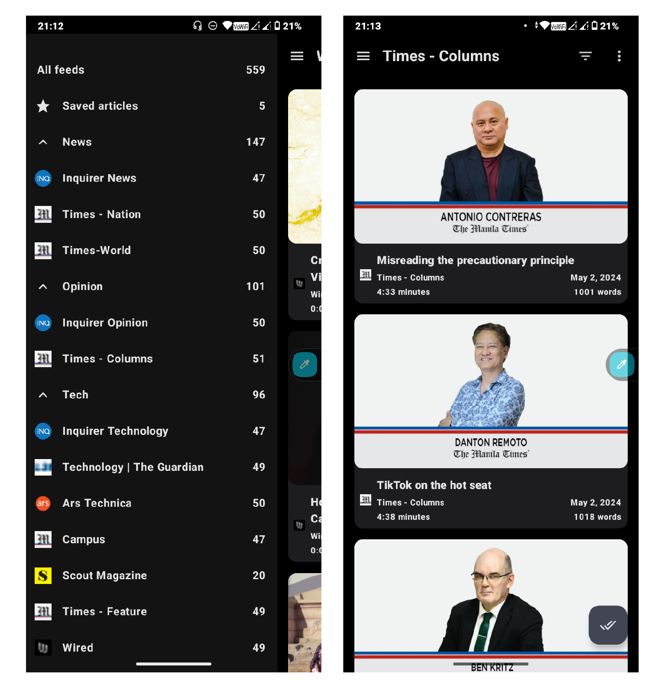
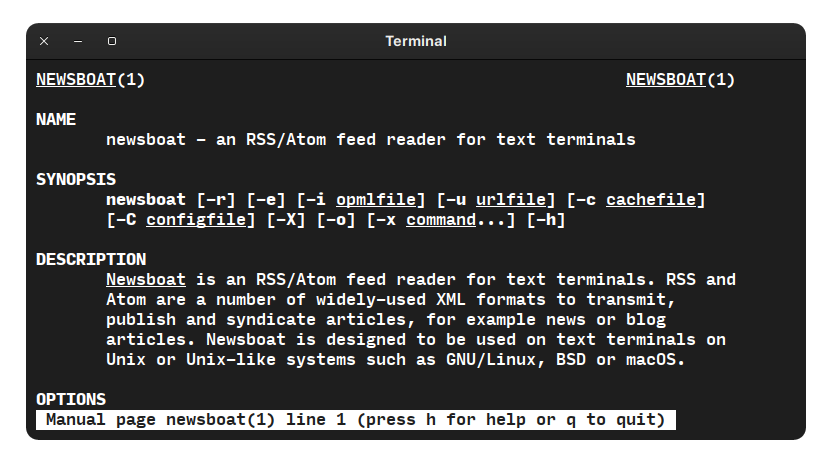
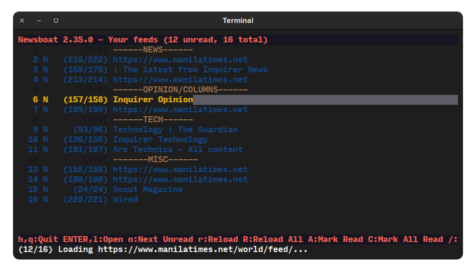
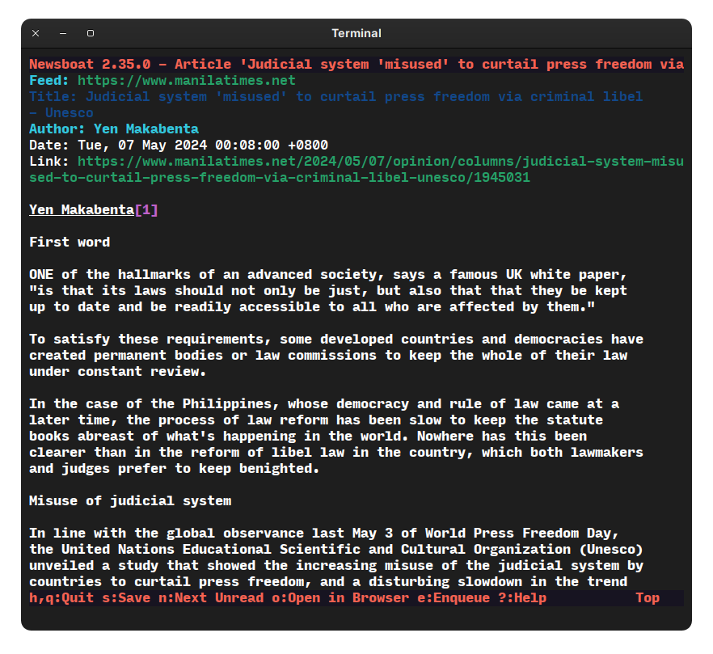
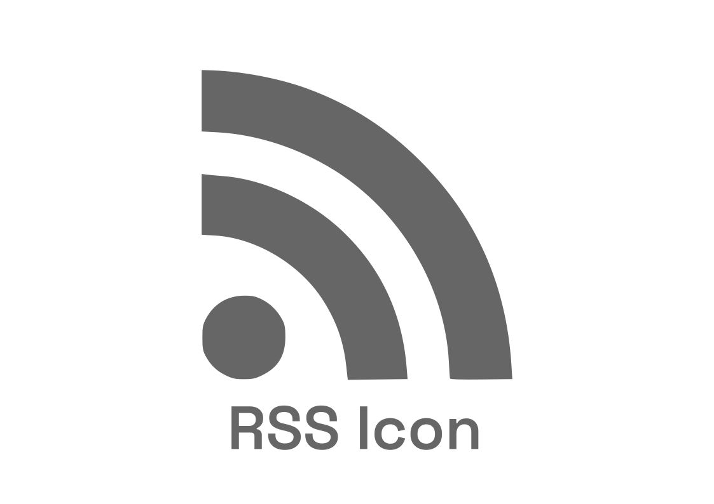

+++
title = "📰 Ditch the Algorithm: Web Content Aggregation with RSS Feeds"
date = "2024-05-03"
draft = false
description = "A comprehensive guide on aggregating news as web content using RSS feeds."
[extra]
[taxonomies]
tags = ["Tech"]
+++


*"RSS enables us to break free from the information overload and take control of our online consumption. It's a game-changer for both publishers and readers."*


## I. Why You'd Want This:
In this digital age, where print media is seen as just another 'hassle'; where social media capitalizes on people's attention to feed assorted volumes of information, we cannot help but to fall on its distracting, clout-driven, proprietary, and algorithm-powered nature as a daily source of information and news.

But if you like to be **precise and conscious** on the information you're consuming, it would be best to have a tool that you yourself can configure to aggregate **updates from various websites you'd choose to follow**. This can take place without the expense of setting up an account on a social media platform and dealing with its overwhelming nature. Journalists, Tech enthusiasts, or even just normal people who just wants to follow updates from their frequently visited sites; **anyone who chooses to have control over their consumption, would want to read news (or any web content) aggregated with RSS Feeds**. With RSS Feeds, you will have a newspaper in your pocket.

### WTF is an RSS Feed?
**Really Simple Syndication (RSS) feeds** are basically just **files** that get updated every time a website publishes a new content. This file now contains **details** from the name of the author, date published, link, the content's summary, or even the whole content. Now we can see how direct this is: from the writers/creators, or even media outlets, straight to your RSS Feed aggregator, this happens without any middle party, except for the internet, and your aggregator itself. Content arrives at your doorstep without the creeping force of analytics and algorithm, simply because you called [chose] for these content to arrive.

---
## II. Aggregating Feeds

**Free and Open-Source Software** are pieces of software that are distributed for free—in the context of money—and having its source code available for anyone; to audit, secure, or maybe even edit it according to their taste. Therefore, **FREEDOM!**


Building your feed is **as simple as copy and pasting links**. But first, we need to talk about what you should be **copying**, and **where you'll be pasting it**. Of course there are ***shortcuts*** [Feedly, Google Feeds, etc.] on this field of reading 'news feeds', you can even utilize the power of Artificial Intelligence for this specific job. But most of these services are, again, ***appealing to your recent searches, interests, and even scooping data from your other applications*** [*yes, they can do that*] just to deliver you pieces of filtered information, tailored to your impulses.

### RSS Feed Aggregators
This [piece of software] is where you'll be pasting, or importing the RSS feeds you've gathered yourself. There are quite diverse methods out there to aggregate feeds [i.e. using a web-based news feed like [TinyRSS](https://tt-rss.org/), [NextCloud News](https://apps.nextcloud.com/apps/news), etc.], but this article is limited on showcasing **local mobile and desktop applications that I have used to aggregate web content**.


Note that **Android is the main character** in this case, as it caters freedom to its users allowing them to install applications outside the Google Play Store. 

### ❯❯ Feeder
**Feeder by spacecowboy**.

💽 You can find the source code in its repo: [https://github.com/spacecowboy/Feeder](https://github.com/spacecowboy/Feeder).

💽 And you can get Feeder on [F-Droid](https://f-droid.org/repository/browse/?fdid=com.nononsenseapps.feeder), and [Play Store](https://play.google.com/store/apps/details?id=com.nononsenseapps.feeder.play).

**Feeder is an open-source feed reader** (RSS/Atom/JSONFeed) for Android created in 2014. It **does NOT sync with usual remote backends** so **no account registration** of any kind is necessary. Feeder is free to use and runs locally on your device. Your data is 100% private.


I've been using Feeder since 2020, reading what I chose to read. Feeder is one of those "no bullshit" applications that one normie can just install to their phone and use it right away without the need to be tinkering with the app. 

**Here are a couple of screenshots:** 
 

**Some of my favorite features of Feeder:**
- **Offline Reading** - Feeder allows you to pre-download your chosen articles upon fetching it. This is a plus when you don't want the distraction of the webpage itself; You can just read it in plain, unformatted text, of course images will still be present. 
- **Material Design** - Our tastes on design are subjective. But material design is another plus for an app that just makes sense. From its super compact to the card style of the feed items, Material Design just fits my thirst for modern, good design.
- **OPML Import/Export** - to have your links gathered in a single file (OPML) can make everything portable. I actually have a peer-to-peer synced OPML file between my computer and phone that gets updated every change.

### ❯❯ Newsboat 
Newsboat is a terminal-based RSS/Atom feed reader written in Rust. This might not be a user friendly choice (for normies of course) as this runs on a terminal (that black window with a blinking cursor and plain text). But anyone can learn how to use one 😉.

 
**Get Newsboat through:** 
- Their website: [https://newsboat.org](https://newsboat.org)
- Or if you're on Linux, you can check if Newsboat is available to your distribution's package manager.
- Or you can just compile it yourself using the source-code from their git repository.

The screenshots below shows my current feeds in its purest text form which I can read **without even touching the mouse or touchpad** (*because I'm a NeoVim person, BTW*). Through Newsboat, we can read articles without friction and distraction.
 
 

---

## III. Finding the File
We already know that RSS/Atom feeds are files uploaded every time a website publishes new content, but **how do we find it?**
 


Above is the universal icon of RSS feeds. This is what you should find if you want to have a feed of a particular website (this website is an example).


### In case you didn't find that icon
There are cases that websites do generate RSS feeds for their 
audiences, **but chooses not to show the RSS icon.** The way you can get the link is to search for it through your browser's Developer Tools. You can enter the developer mode by right-clicking your mouse, then choose the ***'Inspect'*** option. 

The source-code of the website should be shown, and what you're going to do is to search for keywords such as '**RSS**', and '**Atom**'. If you do find a hyperlink that leads you to a .xml file, then congratulations, that's the file you're looking for.

You can then **paste the link of that file to your chosen RSS feed reader** to enjoy the stream of updates from your favorites; Without any blabbery of an algorithm.

~or you can just doom scroll~
